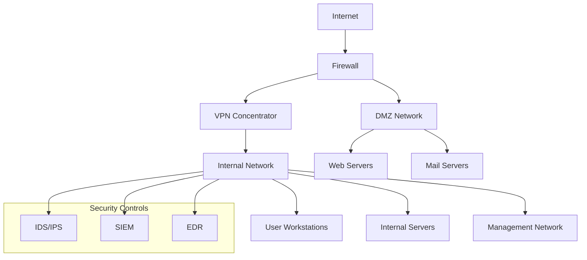

# 🏗️ Project 3: Secure Network Architecture Design

## 📋 Project Overview

Design and document comprehensive secure network architectures for Small-Medium Enterprises (SMEs) and cloud environments, incorporating modern security principles like Zero Trust and defense-in-depth.

**Difficulty**: Beginner-Intermediate  
**Time Required**: 6-8 hours  
**Skills Gained**: Network Design, Security Architecture, Documentation, Risk Assessment

## 🎯 Learning Objectives

- Design secure network architectures for different business sizes
- Implement Zero Trust security principles
- Create comprehensive security documentation
- Assess and mitigate network security risks
- Design cloud-native security architectures
- Develop network segmentation strategies

## 🛠️ Required Tools

### Software
- **Draw.io** (Free) or **Lucidchart** (Free tier)
- **Microsoft Visio** (Professional)
- **Cisco Packet Tracer** (Free)
- **GNS3** (Free)
- **Microsoft Word/Google Docs**

### Templates
- Network diagram templates
- Security assessment frameworks
- Risk assessment matrices
- Documentation templates

## 🚀 Step-by-Step Implementation

### Phase 1: Requirements Analysis

#### 1.1 Business Requirements Gathering
```markdown
# Business Requirements Document

## Company Profile
- **Company Name**: [SME Name]
- **Industry**: [Technology/Healthcare/Finance/etc.]
- **Size**: [50-500 employees]
- **Locations**: [Single/Multiple sites]
- **Budget**: [Security budget range]

## Business Requirements
- **Remote Work Support**: [Yes/No]
- **Cloud Services**: [AWS/Azure/GCP/Hybrid]
- **Compliance**: [HIPAA/SOX/PCI-DSS/GDPR]
- **High Availability**: [99.9%/99.99%/99.999%]
- **Scalability**: [Growth projections]

## Security Requirements
- **Data Classification**: [Public/Internal/Confidential/Restricted]
- **Access Control**: [Role-based/Attribute-based]
- **Monitoring**: [24/7/8-5/On-demand]
- **Incident Response**: [In-house/Outsourced/Hybrid]
```

#### 1.2 Threat Modeling
```markdown
# Threat Assessment Matrix

## External Threats
| Threat | Likelihood | Impact | Risk Level | Mitigation |
|--------|------------|--------|------------|------------|
| DDoS Attacks | Medium | High | Medium | DDoS Protection, CDN |
| Malware | High | Medium | High | EDR, Email Security |
| Phishing | High | Medium | High | Security Awareness, Email Filtering |
| Ransomware | Medium | High | High | Backup, EDR, Segmentation |

## Internal Threats
| Threat | Likelihood | Impact | Risk Level | Mitigation |
|--------|------------|--------|------------|------------|
| Insider Threats | Low | High | Medium | DLP, Access Controls |
| Accidental Data Loss | Medium | Medium | Medium | Backup, Training |
| Privilege Abuse | Low | High | Medium | PAM, Monitoring |
| Social Engineering | Medium | Medium | Medium | Training, Policies |
```

### Phase 2: Architecture Design

#### 2.1 SME Network Architecture (On-Premises)

##### Core Network Design
```yaml
# Network Architecture Components

## Core Infrastructure
- **Internet Edge**: Dual ISP connections with failover
- **DMZ**: Public-facing services (web, email, VPN)
- **Internal Network**: User workstations and servers
- **Management Network**: Network management and monitoring
- **Backup Network**: Dedicated backup infrastructure

## Security Zones
- **Zone 1**: Internet (Untrusted)
- **Zone 2**: DMZ (Semi-trusted)
- **Zone 3**: Internal (Trusted)
- **Zone 4**: Management (Highly trusted)
- **Zone 5**: Backup (Isolated)

## Network Segmentation
- **VLAN 10**: Management (192.168.10.0/24)
- **VLAN 20**: Internal Users (192.168.20.0/24)
- **VLAN 30**: Servers (192.168.30.0/24)
- **VLAN 40**: DMZ (192.168.40.0/24)
- **VLAN 50**: Backup (192.168.50.0/24)
```

##### Security Controls Implementation
```bash
# Firewall Rules Configuration

## Internet to DMZ
- Allow HTTP/HTTPS to web servers
- Allow SMTP to mail servers
- Allow VPN traffic to VPN concentrator
- Block all other traffic

## DMZ to Internal
- Allow specific application traffic
- Block direct access to internal resources
- Log all traffic for monitoring

## Internal to Internet
- Allow outbound web traffic
- Allow email traffic
- Allow DNS queries
- Block known malicious destinations

## Internal Segmentation
- Restrict inter-VLAN communication
- Allow only necessary services
- Implement micro-segmentation where possible
```

#### 2.2 Cloud-Native Architecture

##### AWS Security Architecture
```yaml
# AWS Security Components

## Network Security
- **VPC**: Private cloud network
- **Security Groups**: Instance-level firewalls
- **NACLs**: Subnet-level access control
- **WAF**: Web application firewall
- **Shield**: DDoS protection

## Identity & Access
- **IAM**: Identity and access management
- **Cognito**: User authentication
- **SSO**: Single sign-on
- **MFA**: Multi-factor authentication

## Monitoring & Logging
- **CloudTrail**: API logging
- **CloudWatch**: Monitoring and alerting
- **GuardDuty**: Threat detection
- **Config**: Compliance monitoring

## Data Protection
- **KMS**: Key management
- **S3**: Secure object storage
- **RDS**: Managed databases
- **Backup**: Automated backups
```

##### Azure Security Architecture
```yaml
# Azure Security Components

## Network Security
- **Virtual Network**: Private network
- **NSGs**: Network security groups
- **Azure Firewall**: Managed firewall
- **DDoS Protection**: DDoS mitigation
- **WAF**: Web application firewall

## Identity & Access
- **Azure AD**: Identity management
- **Conditional Access**: Risk-based policies
- **Privileged Identity Management**: PAM
- **MFA**: Multi-factor authentication

## Security Services
- **Security Center**: Security management
- **Sentinel**: SIEM solution
- **Defender**: Endpoint protection
- **Key Vault**: Secret management
```

#### 2.3 Zero Trust Architecture

##### Zero Trust Principles Implementation
```markdown
# Zero Trust Implementation

## 1. Never Trust, Always Verify
- **Identity Verification**: Multi-factor authentication for all users
- **Device Verification**: Device health checks and compliance
- **Network Verification**: Encrypted connections and micro-segmentation

## 2. Least Privilege Access
- **Role-Based Access Control**: Granular permissions
- **Just-In-Time Access**: Temporary elevated privileges
- **Privileged Access Management**: Secure admin access

## 3. Assume Breach
- **Continuous Monitoring**: Real-time threat detection
- **Incident Response**: Automated response capabilities
- **Forensic Readiness**: Logging and evidence collection

## 4. Micro-Segmentation
- **Network Segmentation**: Isolated network zones
- **Application Segmentation**: Service-to-service controls
- **Data Segmentation**: Data classification and protection
```

### Phase 3: Detailed Design Documentation

#### 3.1 Network Diagrams

##### High-Level Architecture


##### Detailed Network Design
```bash
# Network Addressing Scheme

## Core Network (192.168.0.0/16)
- **Management Network**: 192.168.10.0/24
  - Network devices: 192.168.10.1-50
  - Management servers: 192.168.10.51-100
  - Monitoring tools: 192.168.10.101-150

- **Internal Users**: 192.168.20.0/24
  - Workstations: 192.168.20.1-200
  - Printers: 192.168.20.201-220
  - Mobile devices: 192.168.20.221-240

- **Internal Servers**: 192.168.30.0/24
  - File servers: 192.168.30.1-20
  - Database servers: 192.168.30.21-40
  - Application servers: 192.168.30.41-60

- **DMZ**: 192.168.40.0/24
  - Web servers: 192.168.40.1-20
  - Mail servers: 192.168.40.21-30
  - VPN concentrator: 192.168.40.31

- **Backup Network**: 192.168.50.0/24
  - Backup servers: 192.168.50.1-20
  - Storage arrays: 192.168.50.21-40
```

#### 3.2 Security Control Matrix

##### Technical Controls
```markdown
# Security Control Implementation

## Perimeter Security
- **Firewalls**: Next-generation firewalls with IPS
- **DDoS Protection**: Cloud-based DDoS mitigation
- **Web Application Firewall**: WAF for web applications
- **Email Security**: Advanced email filtering and protection

## Network Security
- **Network Segmentation**: VLANs and micro-segmentation
- **Access Control**: NACLs and security groups
- **VPN**: Secure remote access with MFA
- **Network Monitoring**: IDS/IPS and traffic analysis

## Endpoint Security
- **Antivirus**: Next-generation antivirus
- **EDR**: Endpoint detection and response
- **Application Control**: Whitelisting and blacklisting
- **Device Management**: Mobile device management

## Identity & Access
- **Single Sign-On**: Centralized authentication
- **Multi-Factor Authentication**: MFA for all users
- **Privileged Access Management**: Secure admin access
- **Identity Governance**: Access reviews and certifications

## Data Protection
- **Encryption**: Data at rest and in transit
- **Data Loss Prevention**: DLP for sensitive data
- **Backup & Recovery**: Automated backup systems
- **Key Management**: Centralized key management
```

##### Administrative Controls
```markdown
# Administrative Security Controls

## Policies & Procedures
- **Acceptable Use Policy**: IT resource usage guidelines
- **Password Policy**: Strong password requirements
- **Remote Work Policy**: Secure remote access guidelines
- **Incident Response Plan**: Security incident procedures

## Training & Awareness
- **Security Awareness Training**: Regular security training
- **Phishing Simulations**: Regular phishing tests
- **Social Engineering Awareness**: Social engineering training
- **Compliance Training**: Regulatory compliance training

## Risk Management
- **Risk Assessment**: Regular security risk assessments
- **Vendor Management**: Third-party security assessments
- **Change Management**: Security change control procedures
- **Business Continuity**: Disaster recovery planning
```

### Phase 4: Implementation Planning

#### 4.1 Project Timeline
```markdown
# Implementation Timeline (12 weeks)

## Phase 1: Foundation (Weeks 1-3)
- Week 1: Network assessment and planning
- Week 2: Core infrastructure setup
- Week 3: Basic security controls implementation

## Phase 2: Security Implementation (Weeks 4-6)
- Week 4: Firewall and segmentation setup
- Week 5: Identity and access management
- Week 6: Monitoring and logging implementation

## Phase 3: Advanced Security (Weeks 7-9)
- Week 7: Endpoint security deployment
- Week 8: Data protection implementation
- Week 9: Advanced threat protection

## Phase 4: Testing & Optimization (Weeks 10-12)
- Week 10: Security testing and validation
- Week 11: Performance optimization
- Week 12: Documentation and training
```

#### 4.2 Resource Requirements
```markdown
# Resource Requirements

## Human Resources
- **Project Manager**: 1 FTE for 12 weeks
- **Network Engineer**: 1 FTE for 8 weeks
- **Security Engineer**: 1 FTE for 10 weeks
- **System Administrator**: 0.5 FTE for 6 weeks

## Hardware Requirements
- **Firewalls**: 2x Next-generation firewalls
- **Switches**: 4x Managed switches (24/48 port)
- **Servers**: 2x Management servers, 2x backup servers
- **Storage**: 10TB NAS for backups

## Software Requirements
- **Security Tools**: SIEM, EDR, vulnerability scanner
- **Management Tools**: Network monitoring, configuration management
- **Backup Software**: Enterprise backup solution
- **Documentation Tools**: Network documentation software

## Cloud Services (if applicable)
- **IaaS**: Virtual machines and storage
- **Security Services**: Cloud security tools
- **Backup Services**: Cloud backup solutions
- **Monitoring Services**: Cloud monitoring and alerting
```

### Phase 5: Risk Assessment and Mitigation

#### 5.1 Security Risk Assessment
```markdown
# Risk Assessment Matrix

## High-Risk Items
| Risk | Probability | Impact | Mitigation Strategy |
|------|-------------|--------|-------------------|
| Data Breach | Medium | Critical | Encryption, access controls, monitoring |
| Ransomware Attack | High | High | Backup, EDR, user training |
| Insider Threat | Low | High | DLP, monitoring, access reviews |
| DDoS Attack | Medium | Medium | DDoS protection, CDN |

## Medium-Risk Items
| Risk | Probability | Impact | Mitigation Strategy |
|------|-------------|--------|-------------------|
| Phishing Attacks | High | Medium | Email security, user training |
| Malware Infection | High | Medium | EDR, antivirus, user training |
| Configuration Errors | Medium | Medium | Change management, testing |
| Vendor Security | Medium | Medium | Vendor assessments, contracts |

## Low-Risk Items
| Risk | Probability | Impact | Mitigation Strategy |
|------|-------------|--------|-------------------|
| Natural Disasters | Low | High | Business continuity planning |
| Power Outages | Low | Medium | UPS, generator backup |
| Hardware Failures | Low | Medium | Redundancy, monitoring |
```

#### 5.2 Compliance Requirements
```markdown
# Compliance Framework Mapping

## GDPR Compliance
- **Data Protection**: Encryption, access controls
- **Data Processing**: Consent management, data minimization
- **Data Rights**: Right to access, right to be forgotten
- **Breach Notification**: 72-hour notification requirement

## HIPAA Compliance
- **Administrative Safeguards**: Policies, training, access management
- **Physical Safeguards**: Facility access, workstation security
- **Technical Safeguards**: Access control, audit logs, integrity

## PCI-DSS Compliance
- **Network Security**: Firewalls, segmentation
- **Access Control**: Strong authentication, access management
- **Vulnerability Management**: Regular scanning, patching
- **Monitoring**: Log monitoring, incident response

## SOX Compliance
- **Internal Controls**: Financial reporting controls
- **Access Management**: Segregation of duties
- **Audit Trails**: Comprehensive logging
- **Change Management**: Controlled system changes
```

### Phase 6: Documentation and Deliverables

#### 6.1 Architecture Documentation
```markdown
# Network Architecture Documentation

## Executive Summary
- Business objectives and security requirements
- Architecture overview and key decisions
- Risk assessment and mitigation strategies
- Implementation timeline and resource requirements

## Technical Architecture
- Detailed network diagrams and topology
- Security control implementation details
- Network addressing and segmentation
- Integration points and dependencies

## Security Architecture
- Security control matrix and implementation
- Identity and access management design
- Monitoring and logging architecture
- Incident response and recovery procedures

## Operational Procedures
- Network management procedures
- Security monitoring and alerting
- Change management processes
- Backup and recovery procedures

## Compliance and Governance
- Compliance framework mapping
- Risk management procedures
- Audit and assessment procedures
- Policy and procedure documentation
```

#### 6.2 Implementation Guide
```markdown
# Implementation Guide

## Pre-Implementation Checklist
- [ ] Network assessment completed
- [ ] Security requirements defined
- [ ] Resource allocation confirmed
- [ ] Timeline approved
- [ ] Risk assessment completed

## Implementation Steps
1. **Network Assessment**
   - Current network topology analysis
   - Security gap assessment
   - Performance baseline establishment

2. **Design Finalization**
   - Architecture review and approval
   - Security control selection
   - Implementation plan development

3. **Infrastructure Setup**
   - Core network infrastructure deployment
   - Security appliance installation
   - Network segmentation implementation

4. **Security Implementation**
   - Firewall and security policy configuration
   - Identity and access management setup
   - Monitoring and logging deployment

5. **Testing and Validation**
   - Security testing and penetration testing
   - Performance testing and optimization
   - User acceptance testing

6. **Documentation and Training**
   - Technical documentation completion
   - User and administrator training
   - Operational procedures development
```

## 🧪 Testing and Validation

### Security Testing Scenarios
```bash
# Penetration Testing Scenarios

## External Testing
- Port scanning and service enumeration
- Web application vulnerability assessment
- Email security testing
- Social engineering assessment

## Internal Testing
- Network segmentation validation
- Access control testing
- Privilege escalation testing
- Data exfiltration testing

## Physical Testing
- Physical security assessment
- Social engineering (physical)
- Environmental security testing
- Business continuity testing
```

### Performance Testing
```bash
# Performance Validation

## Network Performance
- Bandwidth utilization testing
- Latency and jitter measurement
- Throughput testing
- Load testing

## Security Performance
- Firewall throughput testing
- IDS/IPS performance testing
- VPN performance testing
- Encryption performance testing
```

## 📊 Success Metrics

### Technical Metrics
```markdown
# Technical Success Metrics

## Security Metrics
- **Vulnerability Reduction**: 90% reduction in critical vulnerabilities
- **Incident Response Time**: < 1 hour for critical incidents
- **False Positive Rate**: < 5% for security alerts
- **Patch Compliance**: > 95% systems patched within 30 days

## Performance Metrics
- **Network Availability**: > 99.9% uptime
- **Response Time**: < 100ms for internal applications
- **Throughput**: > 1Gbps for critical applications
- **Latency**: < 50ms for user applications

## Operational Metrics
- **Mean Time to Detection**: < 15 minutes
- **Mean Time to Response**: < 1 hour
- **Mean Time to Recovery**: < 4 hours
- **Change Success Rate**: > 95%
```

### Business Metrics
```markdown
# Business Success Metrics

## Risk Reduction
- **Security Incidents**: 50% reduction in security incidents
- **Data Breaches**: Zero data breaches
- **Compliance Violations**: Zero compliance violations
- **Business Disruption**: < 1 hour annual downtime

## Cost Benefits
- **Security Costs**: 20% reduction in security operational costs
- **Incident Costs**: 75% reduction in incident response costs
- **Compliance Costs**: 30% reduction in compliance costs
- **Insurance Costs**: 25% reduction in cyber insurance premiums
```

## 🔍 Troubleshooting

### Common Implementation Issues
```bash
# Troubleshooting Guide

## Network Connectivity Issues
- Check physical connections and cabling
- Verify VLAN configuration and trunking
- Test routing and firewall rules
- Validate DNS and DHCP configuration

## Security Control Issues
- Verify firewall rule configuration
- Check IDS/IPS signature updates
- Validate authentication and authorization
- Test monitoring and alerting systems

## Performance Issues
- Monitor bandwidth utilization
- Check for network congestion
- Validate QoS configuration
- Test application performance
```

## 📈 Advanced Features

### Micro-Segmentation
```yaml
# Micro-Segmentation Implementation

## Application-Level Segmentation
- **Web Tier**: Isolated web application servers
- **Application Tier**: Isolated application servers
- **Database Tier**: Isolated database servers
- **Management Tier**: Isolated management servers

## User-Level Segmentation
- **Executive Users**: Restricted access to sensitive data
- **Finance Users**: Access to financial systems only
- **HR Users**: Access to HR systems only
- **IT Users**: Access to management systems only

## Data-Level Segmentation
- **Public Data**: Accessible to all users
- **Internal Data**: Accessible to internal users only
- **Confidential Data**: Accessible to authorized users only
- **Restricted Data**: Accessible to specific users only
```

### Zero Trust Implementation
```yaml
# Zero Trust Architecture Components

## Identity Verification
- **Multi-Factor Authentication**: Required for all access
- **Device Health Checks**: Device compliance validation
- **Behavioral Analytics**: User behavior monitoring
- **Risk-Based Authentication**: Dynamic risk assessment

## Network Segmentation
- **Micro-Segmentation**: Application-level isolation
- **Software-Defined Perimeter**: Dynamic access control
- **Network Access Control**: Device-based access control
- **Application Segmentation**: Service-to-service controls

## Continuous Monitoring
- **Real-Time Monitoring**: Continuous security monitoring
- **Threat Detection**: Advanced threat detection
- **Automated Response**: Automated incident response
- **Forensic Analysis**: Comprehensive logging and analysis
```

## 📚 Documentation and Reporting

### Architecture Documentation Template
```markdown
# Network Security Architecture Document

## Document Information
- **Document Title**: [Company Name] Network Security Architecture
- **Version**: 1.0
- **Date**: [Current Date]
- **Author**: [Your Name]
- **Reviewer**: [Reviewer Name]
- **Approval**: [Approver Name]

## Table of Contents
1. Executive Summary
2. Business Requirements
3. Security Requirements
4. Architecture Overview
5. Detailed Design
6. Security Controls
7. Implementation Plan
8. Risk Assessment
9. Compliance Requirements
10. Testing and Validation
11. Operational Procedures
12. Appendices

## Executive Summary
[2-3 page summary of the architecture, key decisions, and business value]

## Business Requirements
[Detailed business requirements and constraints]

## Security Requirements
[Security requirements and threat model]

## Architecture Overview
[High-level architecture description and diagrams]

## Detailed Design
[Detailed technical design and implementation]

## Security Controls
[Security control implementation and configuration]

## Implementation Plan
[Implementation timeline and resource requirements]

## Risk Assessment
[Risk assessment and mitigation strategies]

## Compliance Requirements
[Compliance framework mapping and requirements]

## Testing and Validation
[Testing strategy and validation procedures]

## Operational Procedures
[Operational procedures and maintenance]

## Appendices
[Supporting documentation and references]
```

## 🎯 Career Impact

### Skills Demonstrated
- **Network Architecture Design**
- **Security Control Implementation**
- **Risk Assessment and Management**
- **Compliance Framework Mapping**
- **Technical Documentation**

### Job Roles This Prepares You For
- **Security Architect**
- **Network Security Engineer**
- **Security Consultant**
- **Infrastructure Security Specialist**
- **Cloud Security Architect**

### Certifications This Helps With
- **CISSP** (Certified Information Systems Security Professional)
- **CISM** (Certified Information Security Manager)
- **SABSA** (Sherwood Applied Business Security Architecture)
- **AWS Security Specialty**
- **Azure Security Engineer**

## 🔗 Additional Resources

- [NIST Cybersecurity Framework](https://www.nist.gov/cyberframework)
- [SABSA Framework](https://sabsa.org/)
- [TOGAF Architecture Framework](https://www.opengroup.org/togaf)
- [CIS Controls](https://www.cisecurity.org/controls/)
- [ISO 27001 Information Security](https://www.iso.org/isoiec-27001-information-security.html)

---

**Next Project**: [Project 4: Custom Nmap Automation Tool](../04-nmap-automation/README.md)

**Previous Project**: [Project 2: Wireshark Deep Packet Analysis Report](../02-wireshark-analysis/README.md) 