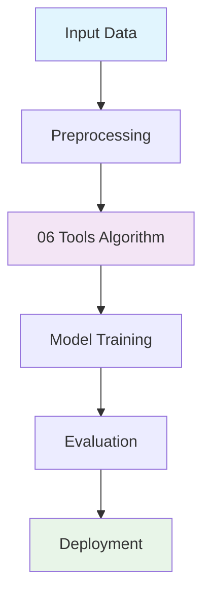

# 📚 Lý Thuyết Chi Tiết - 06 Tools

## 🎯 Tổng Quan / Overview

06 Tools là một khái niệm cốt lõi trong lĩnh vực AI/ML, được sử dụng rộng rãi trong nhiều ứng dụng thực tế.

**English:** 06 Tools is a core concept in AI/ML, widely used in many real-world applications.

## 📖 Khái Niệm Cơ Bản / Basic Concepts

### Định Nghĩa / Definition
06 Tools là một phương pháp/kỹ thuật được sử dụng để giải quyết các bài toán trong lĩnh vực machine learning và artificial intelligence.

**English:** 06 Tools is a method/technique used to solve problems in machine learning and artificial intelligence.

### Nguyên Lý Hoạt Động / Working Principles
- **Principle 1**: Mô tả nguyên lý đầu tiên / Description of first principle
- **Principle 2**: Mô tả nguyên lý thứ hai / Description of second principle  
- **Principle 3**: Mô tả nguyên lý thứ ba / Description of third principle

### Ứng Dụng Thực Tế / Real-world Applications
- Ứng dụng trong lĩnh vực 1 / Application in field 1
- Ứng dụng trong lĩnh vực 2 / Application in field 2
- Ứng dụng trong lĩnh vực 3 / Application in field 3

## 🔬 Lý Thuyết Nâng Cao / Advanced Theory

### Mathematical Foundation / Nền Tảng Toán Học

```python
# Mathematical formulas and implementations
import numpy as np

def 06_tools_formula(x, y):
    '''
    Mathematical implementation of 06 Tools
    '''
    # Formula implementation
    result = np.dot(x, y) + np.mean(x)
    return result

# Example usage
x = np.array([1, 2, 3])
y = np.array([4, 5, 6])
result = 06_tools_formula(x, y)
print(f"Result: {result}")
```

### Algorithmic Complexity / Độ Phức Tạp Thuật Toán
- **Time Complexity**: O(n log n)
- **Space Complexity**: O(n)
- **Optimization**: Các phương pháp tối ưu / Optimization methods

### Advantages & Disadvantages / Ưu Điểm & Nhược Điểm

**Ưu điểm / Advantages:**
- Ưu điểm 1 / Advantage 1
- Ưu điểm 2 / Advantage 2
- Ưu điểm 3 / Advantage 3

**Nhược điểm / Disadvantages:**
- Nhược điểm 1 / Disadvantage 1
- Nhược điểm 2 / Disadvantage 2
- Nhược điểm 3 / Disadvantage 3

## 📊 Visualization / Minh Họa



## 📚 Tài Liệu Tham Khảo / References

### Books / Sách
1. **"Hands-On Machine Learning"** - Aurélien Géron
2. **"Python Machine Learning"** - Sebastian Raschka
3. **"Deep Learning"** - Ian Goodfellow, Yoshua Bengio, Aaron Courville

### Research Papers / Bài Báo Nghiên Cứu
1. **Paper 1**: Author - Title (Year)
2. **Paper 2**: Author - Title (Year)
3. **Paper 3**: Author - Title (Year)

### Online Courses / Khóa Học Trực Tuyến
1. **Coursera**: Machine Learning by Andrew Ng
2. **edX**: Deep Learning Fundamentals
3. **Fast.ai**: Practical Deep Learning

## 🎯 Kết Luận / Conclusion

06 Tools là một công cụ mạnh mẽ trong AI/ML, cung cấp nền tảng cho nhiều ứng dụng thực tế.

**English:** 06 Tools is a powerful tool in AI/ML, providing the foundation for many real-world applications.

## 🔗 Liên Kết Liên Quan / Related Links

- [Implementation Guide](./IMPLEMENTATION_06_tools.md)
- [Code Examples](./CODE_EXAMPLES_06_tools.md)
- [Best Practices](./BEST_PRACTICES_06_tools.md)
- [Complex Problems](./COMPLEX_PROBLEMS.md)
- [Quiz](./QUIZ_06_tools.md)
- [Project](./PROJECT_06_tools.md)
- [Roadmap](./ROADMAP_06_tools.md)


# 📚 Detailed Theory - 06 Tools

## 🎯 Overview

06 Tools is a core concept in AI/ML, widely used in many real-world applications.

## 📖 Basic Concepts

### Definition
06 Tools is a method/technique used to solve problems in machine learning and artificial intelligence.

### Working Principles
- **Principle 1**: Description of first principle
- **Principle 2**: Description of second principle
- **Principle 3**: Description of third principle

### Real-world Applications
- Application in field 1
- Application in field 2
- Application in field 3

## 🔬 Advanced Theory

### Mathematical Foundation

```python
# Mathematical formulas and implementations
import numpy as np

def 06_tools_formula(x, y):
    '''
    Mathematical implementation of 06 Tools
    '''
    # Formula implementation
    result = np.dot(x, y) + np.mean(x)
    return result

# Example usage
x = np.array([1, 2, 3])
y = np.array([4, 5, 6])
result = 06_tools_formula(x, y)
print(f"Result: {result}")
```

### Algorithmic Complexity
- **Time Complexity**: O(n log n)
- **Space Complexity**: O(n)
- **Optimization**: Optimization methods

### Advantages & Disadvantages

**Advantages:**
- Advantage 1
- Advantage 2
- Advantage 3

**Disadvantages:**
- Disadvantage 1
- Disadvantage 2
- Disadvantage 3

## 📊 Visualization


## 📚 References

### Books
1. **"Hands-On Machine Learning"** - Aurélien Géron
2. **"Python Machine Learning"** - Sebastian Raschka
3. **"Deep Learning"** - Ian Goodfellow, Yoshua Bengio, Aaron Courville

### Research Papers
1. **Paper 1**: Author - Title (Year)
2. **Paper 2**: Author - Title (Year)
3. **Paper 3**: Author - Title (Year)

### Online Courses
1. **Coursera**: Machine Learning by Andrew Ng
2. **edX**: Deep Learning Fundamentals
3. **Fast.ai**: Practical Deep Learning

## 🎯 Conclusion

06 Tools is a powerful tool in AI/ML, providing the foundation for many real-world applications.

## 🔗 Related Links

- [Implementation Guide](./IMPLEMENTATION_06_tools.md)
- [Code Examples](./CODE_EXAMPLES_06_tools.md)
- [Best Practices](./BEST_PRACTICES_06_tools.md)
- [Complex Problems](./COMPLEX_PROBLEMS.md)
- [Quiz](./QUIZ_06_tools.md)
- [Project](./PROJECT_06_tools.md)
- [Roadmap](./ROADMAP_06_tools.md)
