# 🎯 ALGORITHM SYSTEM DIAGRAM - MULTILINGUAL STRUCTURE

## 📊 **System Overview Diagram**


---

## 🏗️ **File Structure Diagram**


---

## 🎓 **Learning Path Diagram**


---

## 🔄 **Code Comparison Diagram**

```mermaid
graph LR
    subgraph "🎯 SAME ALGORITHM"
        Algo[Reverse Array Algorithm]
    end

    subgraph "🐍 PYTHON"
        PyCode[```python
def reverse_array(arr):
    left, right = 0, len(arr) - 1
    while left < right:
        arr[left], arr[right] = arr[right], arr[left]
        left += 1
        right -= 1
    return arr
```]
    end

    subgraph "⚡ C++"
        CppCode[```cpp
void reverse_array(vector<int>& arr) {
    int left = 0, right = arr.size() - 1;
    while (left < right) {
        swap(arr[left], arr[right]);
        left++;
        right--;
    }
}
```]
    end

    subgraph "🔧 C"
        CCode[```c
void reverse_array(int arr[], int n) {
    int left = 0, right = n - 1;
    while (left < right) {
        int temp = arr[left];
        arr[left] = arr[right];
        arr[right] = temp;
        left++;
        right--;
    }
}
```]
    end

    subgraph "☕ JAVA"
        JavaCode[```java
public static void reverseArray(int[] arr) {
    int left = 0, right = arr.length - 1;
    while (left < right) {
        int temp = arr[left];
        arr[left] = arr[right];
        arr[right] = temp;
        left++;
        right--;
    }
}
```]
    end

    Algo --> PyCode
    Algo --> CppCode
    Algo --> CCode
    Algo --> JavaCode

    style Algo fill:#e3f2fd
    style PyCode fill:#c8e6c9
    style CppCode fill:#ffcdd2
    style CCode fill:#fff3e0
    style JavaCode fill:#f3e5f5
```

---

## 📊 **Statistics Diagram**


```mermaid
bar title "Difficulty Levels per Group"
    "Level 1-5 (Easy)" : 500
    "Level 6-10 (Medium)" : 500
    "Level 11-15 (Hard)" : 500
    "Level 16-20 (Expert)" : 500
```

---

## 🎯 **Usage Workflow Diagram**

```mermaid
sequenceDiagram
    participant User as 👤 User
    participant Overview as 📄 LANGUAGE_FILES_OVERVIEW.md
    participant Group as 📁 Algorithm Group
    participant LangFile as 📄 Language_LEVELS.md
    participant Code as 💻 Code Implementation

    User->>Overview: Open overview file
    Overview->>User: Show all groups and languages
    
    User->>Group: Choose algorithm group
    Group->>User: Show available language files
    
    User->>LangFile: Open specific language file
    LangFile->>User: Display 20 levels of code
    
    User->>Code: Study specific level
    Code->>User: Show implementation + examples
    
    User->>LangFile: Practice next level
    LangFile->>User: Continue learning
    
    Note over User,Code: User can switch between languages for comparison
```



---

## 🌟 **Benefits Visualization**


---

## 🎉 **System Architecture Summary**

### **📊 Total Components:**
- **100 Algorithm Groups** × **4 Languages** = **400 Language Files**
- **20 Levels** × **100 Groups** × **4 Languages** = **8,000 Code Examples**
- **5 Summary Files** for navigation and overview
- **100 README Files** for each group

### **🎯 Key Features:**
- **Modular Design**: Each language is independent
- **Scalable Structure**: Easy to add new languages
- **Comprehensive Coverage**: All major algorithm patterns
- **Professional Quality**: Production-ready code examples

### **🚀 Learning Advantages:**
- **Focused Study**: One language at a time
- **Easy Comparison**: Side-by-side analysis
- **Progressive Difficulty**: 20 levels per group
- **Real-World Ready**: Practical implementations

---

**🎯 This diagram system provides a complete visual understanding of your multilingual algorithm learning platform! 🎯** 