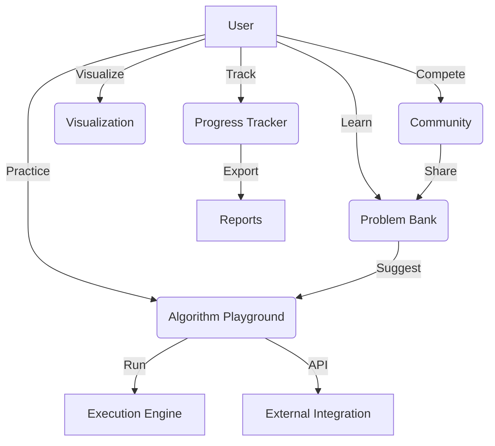

# PROJECT DISCUSSION - Algorithm Ecosystem

## 1. Mục tiêu dự án
- Tích hợp, trình diễn, và cho phép thực hành tất cả 100 giải thuật.
- Cho phép người dùng học, thử nghiệm, so sánh, và áp dụng giải thuật vào các bài toán thực tế.
- Có thể mở rộng thành nền tảng cộng đồng, nơi mọi người chia sẻ, thi đấu, và đóng góp giải thuật mới.

---

## 2. Các module chính của hệ sinh thái

### A. Algorithm Playground
- Chạy thử, so sánh, benchmark các giải thuật (Python/C++/C/Java).
- Cho phép nhập dữ liệu, xem kết quả, so sánh hiệu suất.

### B. Problem Bank & Practice
- Kho bài toán thực tế, mỗi bài liên kết với các giải thuật phù hợp.
- Người dùng chọn bài, chọn giải thuật, code và kiểm thử trực tiếp.

### C. Learning Path & Progress Tracker
- Lộ trình học tập cá nhân hóa, gợi ý giải thuật tiếp theo.
- Theo dõi tiến độ, xuất báo cáo, nhận huy hiệu thành tích.

### D. Visualization & Explanation
- Mô phỏng trực quan từng giải thuật (Mermaid, animation, step-by-step).
- Giải thích code, highlight các bước quan trọng.

### E. Community & Competition
- Đấu trường giải thuật (contest, ranking, leaderboard).
- Chia sẻ giải pháp, bình luận, thảo luận.

### F. API & Integration
- API cho phép tích hợp với các hệ thống khác (LeetCode, HackerRank, dashboard cá nhân, v.v).

---

## 3. Kiến trúc tổng thể (gợi ý)

---

## 4. Công nghệ gợi ý
- **Backend:** Python (FastAPI/Flask), Node.js, hoặc Java Spring Boot
- **Frontend:** ReactJS/VueJS + MermaidJS + ChartJS
- **Runner:** Docker sandbox cho code đa ngôn ngữ
- **Database:** PostgreSQL/MongoDB
- **Realtime:** WebSocket cho contest, chat, live ranking
- **CI/CD:** Docker, Github Actions

---

## 5. Lộ trình phát triển
1. **Giai đoạn 1:** Xây dựng Playground + Problem Bank + Visualization (core)
2. **Giai đoạn 2:** Thêm Progress Tracker, Learning Path, Export/Import
3. **Giai đoạn 3:** Mở rộng Community, Contest, API
4. **Giai đoạn 4:** Tích hợp với các nền tảng khác, mở rộng kho bài toán

---

## 6. Demo tính năng
- Chạy thử thuật toán "Sliding Window" với input tuỳ ý, xem code đa ngôn ngữ, so sánh hiệu suất.
- Chọn bài toán "Tìm dãy con có tổng lớn nhất", thử nghiệm với nhiều giải thuật khác nhau.
- Theo dõi tiến độ học tập, nhận gợi ý bài tiếp theo.
- Tham gia contest, nhận ranking, chia sẻ giải pháp.

---

## 7. Checklist phát triển
- [ ] Khởi tạo cấu trúc dự án (backend, frontend, docs)
- [ ] Xây dựng module Playground (chạy thử giải thuật)
- [ ] Xây dựng Problem Bank (kho bài toán)
- [ ] Module Visualization (mô phỏng, giải thích)
- [ ] Module Progress Tracker (theo dõi tiến độ)
- [ ] Module Community (contest, chia sẻ)
- [ ] API tích hợp bên ngoài
- [ ] Viết tài liệu hướng dẫn sử dụng

---

## 8. Ý tưởng mở rộng
- Tích hợp AI gợi ý giải thuật phù hợp cho từng bài toán
- Tự động sinh đề luyện tập cá nhân hóa
- Hệ thống badge/thành tích, gamification
- Tích hợp với LeetCode/HackerRank
- Dashboard thống kê, xuất báo cáo PDF/CSV

---

## 9. Hướng dẫn sử dụng và phát triển
- Mỗi module nên có README riêng
- Sử dụng Docker để dễ dàng phát triển và deploy
- Ưu tiên phát triển MVP (Minimum Viable Product) trước, sau đó mở rộng dần

---

**Bạn có thể tách các phần này thành file nhỏ hơn nếu muốn quản lý chi tiết hơn.** 