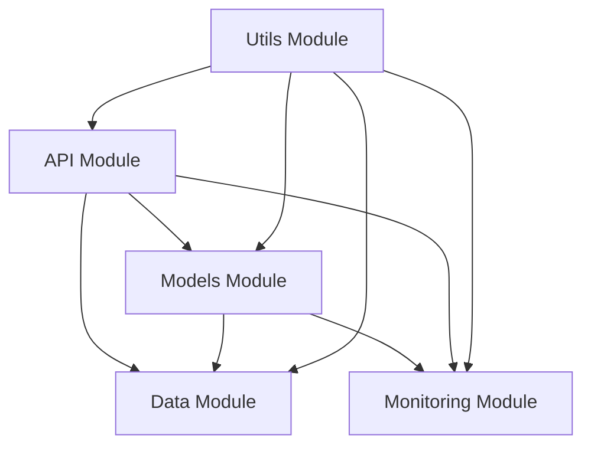

# Source Code Structure

## Overview
This directory contains the main source code for the MLOps project. The codebase is organized into several modules, each responsible for specific functionality.

## Directory Structure

### 1. API Module (`api/`)
- FastAPI-based REST API implementation
- Endpoints for model management, predictions, and monitoring
- Authentication and authorization middleware
- API documentation and OpenAPI specifications

### 2. Data Module (`data/`)
- Data ingestion and preprocessing
- Feature engineering
- Data validation and quality checks
- Data versioning and lineage tracking

### 3. Models Module (`models/`)
- Model training and evaluation
- Model versioning and registry
- Model deployment and serving
- Model monitoring and drift detection

### 4. Monitoring Module (`monitoring/`)
- Metrics collection and aggregation
- Performance monitoring
- Resource utilization tracking
- Alert generation and management

### 5. Utils Module (`utils/`)
- Common utility functions
- Configuration management
- Logging setup
- Helper functions

## Module Dependencies

## Development Guidelines
1. Each module should have its own tests directory
2. Follow the established coding standards
3. Document all public interfaces
4. Use type hints for all functions
5. Implement proper error handling
6. Write unit tests for all new functionality

## Testing
- Unit tests: `pytest tests/unit`
- Integration tests: `pytest tests/integration`
- End-to-end tests: `pytest tests/e2e`

## Documentation
- API documentation: `docs/api.md`
- Development guide: `docs/development.md`
- Deployment guide: `docs/deployment.md`
- Monitoring guide: `docs/monitoring.md` 